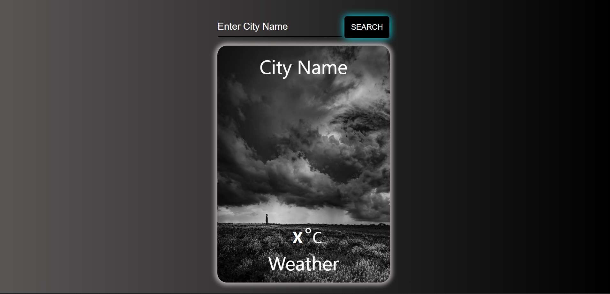

# WeatherApp
This impressive weather application has been developed using HTML, CSS, and JavaScript by using the Open Weather Map API. Notable features of this weather application include the provision of weather updates for the user's respective city and an aesthetically pleasing CSS design.

